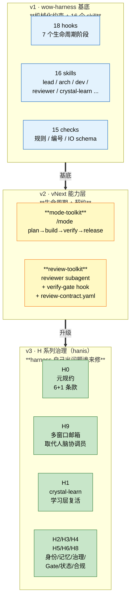

# wow-harness 在 Towow 的实践

> 53 天 / 1137 commits / 93 万行 / 1992 测试，一个人 + AI 全自主交付。
> 这两张图是 harness 当前真实在跑的样子。

---

## 图 1：你说一句话，AI 自己干完 8 关

```mermaid
flowchart LR
    U([你说<br/>"我要做 X"]):::user --> G0
    G0 --> G1 --> G2 --> G34 --> G56 --> G7 --> G8 --> PR

    G0[Gate 0<br/>lead 锁问题<br/>判定变更分类]:::work
    G1[Gate 1<br/>arch 出架构<br/>列消费方]:::work
    G2[Gate 2<br/>**独立审查 AI**<br/>tools 无 Edit/Write]:::review
    G34[Gate 3-4<br/>plan-lock 冻结方案<br/>独立审查]:::review
    G56[Gate 5-6<br/>task-arch 拆 WP<br/>独立审查]:::review
    G7[Gate 7<br/>harness-dev 写代码<br/>边写边记日志]:::work
    G8[Gate 8<br/>终审<br/>E2E 验收]:::review
    PR([accept PR]):::user

    classDef user fill:#fff3cd,stroke:#856404,color:#000
    classDef work fill:#d1ecf1,stroke:#0c5460,color:#000
    classDef review fill:#f8d7da,stroke:#721c24,color:#000
```

**你做的**：定方向、纠偏、accept PR
**AI 做的**：中间 8 关全自动；红色那 4 关由**全新独立的 AI** 接手，从头看，没有 Edit / Write 工具，物理上改不了代码

---

## 图 2：三层 harness（v1 → v2 → v3）



**怎么读这张图**：
- 蓝色（v1）= 一开始就有的：hooks 物理拦截 + skills 各司其职 + checks 自动验证
- 黄色（v2）= 长出来的能力：让 harness 知道"现在该做什么阶段"，让审查变成契约驱动
- 绿色（v3）= 兜底治理：harness 自己跑出问题之后才补的（编号撞、记忆涨爆、协调员断线、修问题反而引入问题）

**v3 一直闭合不再开新站，本身就是稳态信号。**

---

## 想直接看实现的话

| 你想看 | 打开这个文件 |
|---|---|
| 审查 AI 物理上改不了代码 | [`.claude/plugins/towow-review-toolkit/agents/reviewer.md`](../.claude/plugins/towow-review-toolkit/agents/reviewer.md) — 顶上 `tools:` 列表 |
| ADR 编号撞了 git 拒绝提交 | [`.githooks/pre-commit`](../.githooks/pre-commit) + [`scripts/checks/check_adr_plan_numbering.py`](../scripts/checks/check_adr_plan_numbering.py) |
| AI 之间怎么传消息（H9 邮箱） | [`.towow/inbox/schema/message-v1.json`](../.towow/inbox/schema/message-v1.json) |
| 16 个 skill 怎么分工 | [`.claude/skills/`](../.claude/skills/) |
