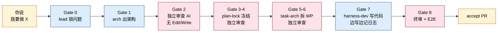
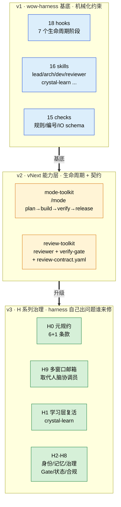

# wow-harness 在 Towow 的实践

> **本地展示**：双击打开 [`docs/practice.html`](./practice.html)（浅色主题，纯 HTML+CSS，不依赖任何渲染引擎）。
> 下面是同一份内容的 GitHub 在线版本（Mermaid 渲染）。

53 天 / 1137 commits / 93 万行 / 1992 测试 — 一个人 + AI 全自主交付。
两张图是 harness 当前真实在跑的样子。

---

## 图 1 · 你说一句话，AI 自己干完 8 关

- 黄色 = 你的输入 / 你的决策
- 蓝色 = AI 执行（lead / arch / dev）
- 红色 = 独立审查 AI — 不共享之前对话从头看；tools 列表里物理移除 Edit / Write，**不是嘱咐它「只看不改」，是它根本调不出这两个工具**

---

## 图 2 · 三层 harness（v1 → v2 → v3）

- **v1（蓝）一开始就有的**：hooks 物理拦截 + skills 各司其职 + checks 自动验证
- **v2（黄）长出来的能力**：让 harness 知道"现在该做什么阶段"，让审查变成契约驱动
- **v3（绿）兜底治理**：harness 自己跑出问题之后才补的（编号撞 / 记忆涨爆 / 协调员断线 / 修问题反而引入问题）。**v3 一直闭合不再开新站，本身就是稳态信号。**

---

## 想直接看实现的话

| 你想看 | 打开这个 |
|---|---|
| 审查 AI 物理上改不了代码 | [`.claude/plugins/towow-review-toolkit/agents/reviewer.md`](../.claude/plugins/towow-review-toolkit/agents/reviewer.md) — 看顶上 `tools:` 列表 |
| ADR 编号撞了 git 直接拒绝提交 | [`.githooks/pre-commit`](../.githooks/pre-commit)（22 行 shell）+ [`scripts/checks/check_adr_plan_numbering.py`](../scripts/checks/check_adr_plan_numbering.py) |
| AI 之间怎么传消息（H9 邮箱） | [`.towow/inbox/schema/message-v1.json`](../.towow/inbox/schema/message-v1.json) + 5 个 inbox hook |
| 16 个 skill 怎么分工 | [`.claude/skills/`](../.claude/skills/) |
| 所有 hook IO schema | [`scripts/hooks/_hook_output.py`](../scripts/hooks/_hook_output.py) — 16 个 helper API（ADR-058） |
